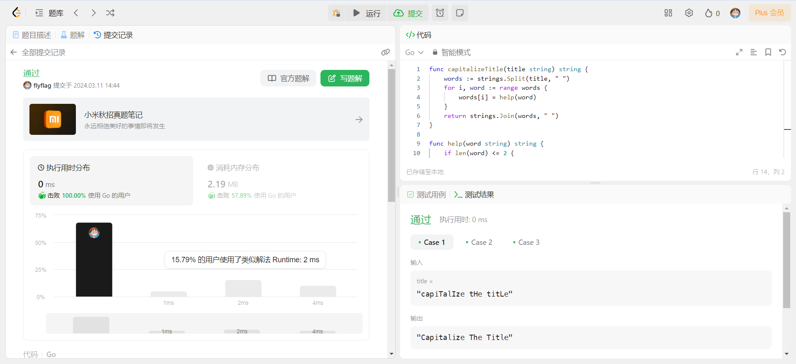

# 题目链接
https://leetcode.cn/problems/capitalize-the-title/description/

# 提交记录

# 状态
通过(AC)

# 反思
字符串处理
- 分割
- 组合
- 转换大写
- 转换小写

使用的方法
- strings.Split()
- strings.Join()
- strings.ToLower()
- strings.ToUpper()
- 字符串组合使用+
- 字符串分割使用index
